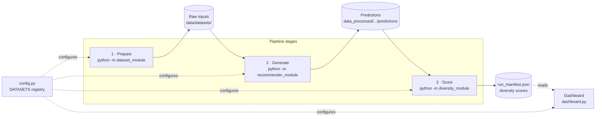
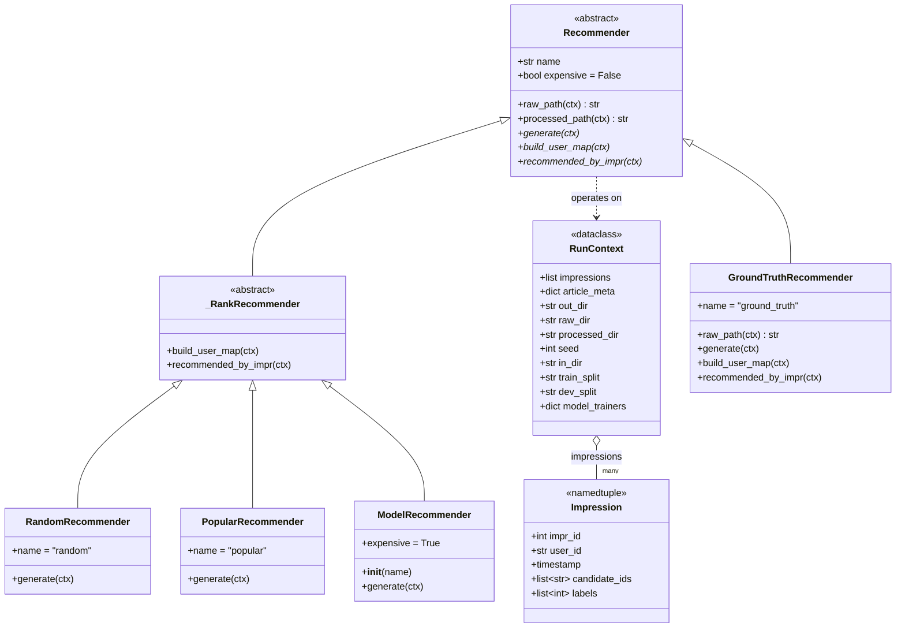
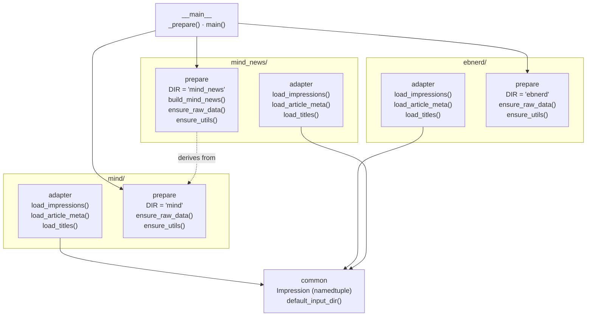
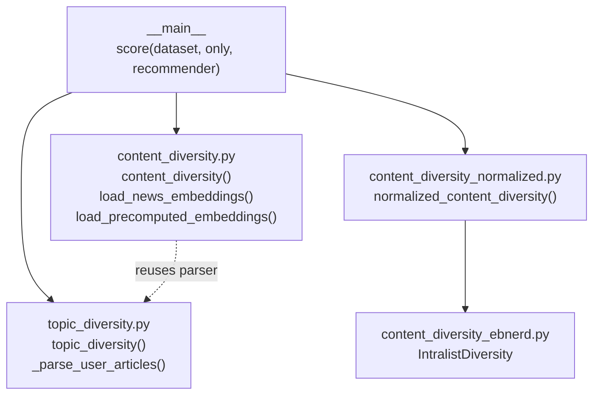

# NRS-DivA architecture

NRS-DivA (News Recommender System – Diversity Analyser) is a three-stage
news-recommender **diversity benchmark**: prepare
datasets → generate recommendations → score diversity, with a dashboard reading
the results.

## Overview

The three stages are separate CLI entry points that hand off through files on
disk; `config.py` is the shared registry describing every dataset.



## Class diagram — recommender hierarchy & core types



## Module — `dataset_module` (prepare & parse)

Each dataset is its own package with a matching pair of interfaces: an `adapter`
(parses the raw format into `Impression` records) and a `prepare` module
(downloads / builds the raw inputs). `__main__` prepares one or all of them.



## Module — `recommender_module` (generate predictions)

`base.py` is the hub: `build_context()` loads a dataset once and
`build_recommenders()` assembles the `Recommender` hierarchy. The cheap
recommenders live in `common/`; the neural models are per-dataset training
scripts imported lazily (they pull in TensorFlow) via `config.model_trainers`.

```mermaid
flowchart TB
    MAIN["__main__<br/>generate(dataset, only)"]
    BASE["base.py<br/>build_context()<br/>build_recommenders()<br/>Recommender hierarchy · RunContext"]

    subgraph common["common/"]
        IO["io.py<br/>save_predictions()<br/>save_user_article_map*()<br/>recommended_per_impression_*()"]
        RND["random_rec<br/>random_recommend()"]
        POP["popular_rec<br/>popular_recommend()"]
        GT["ground_truth<br/>extract_ground_truth()<br/>save_ground_truth()"]
    end

    subgraph models["model trainers (lazy · TensorFlow)"]
        MS["mind_specific/<br/>nrms_mind.run()<br/>lstur_mind.run()<br/>naml_mind.run()"]
        ES["ebnerd_specific/<br/>nrms_ebnerd.run()<br/>lstur_ebnerd.run()<br/>naml_ebnerd.run()"]
    end

    MAIN --> BASE
    BASE --> IO
    BASE --> RND & POP & GT
    BASE -. imports via config.model_trainers .-> MS & ES
```

## Module — `diversity_module` (score diversity)

`__main__` computes each measure across every recommender that has a prediction.
The normalized metric delegates to the `IntralistDiversity` class; the content
metric reuses `topic_diversity`'s per-user file parser.



## How it fits together

- **`RunContext`** is the single handle threaded through every recommender —
  `build_context()` in `recommender_module/base.py` loads a dataset once (via its
  configured adapter/prepare hook) and hands back `(cfg, ctx, recommenders)`.
- The **`Recommender` hierarchy** is the main polymorphism point:
  `_RankRecommender` subclasses share the "build the per-user map from a full-rank
  file" logic (random/popular/model), while `GroundTruthRecommender` overrides the
  file layout. `ModelRecommender` is the only `expensive` one — it lazily imports a
  per-dataset TensorFlow training script from `config.model_trainers`.
- **`scores.py`** owns the `run_manifest.json` — the one shared data contract
  between the generate stage, the score stage, and the read-only **dashboard**.
