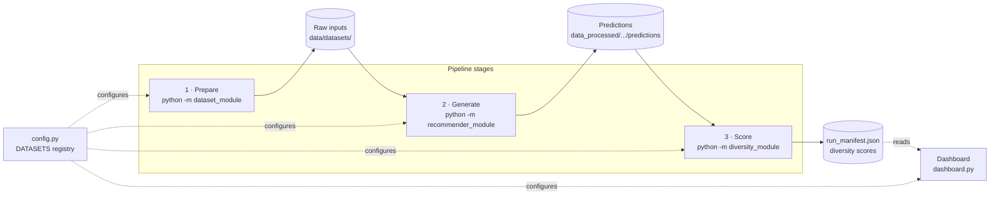

# NRS-DivA architecture

NRS-DivA (News Recommender System – Diversity Analyser) is a three-stage
news-recommender **diversity benchmark**: prepare
datasets → generate recommendations → score diversity, with a dashboard reading
the results.

The three stages are separate CLI entry points that hand off through files on
disk; `config.py` is the shared registry describing every dataset.

